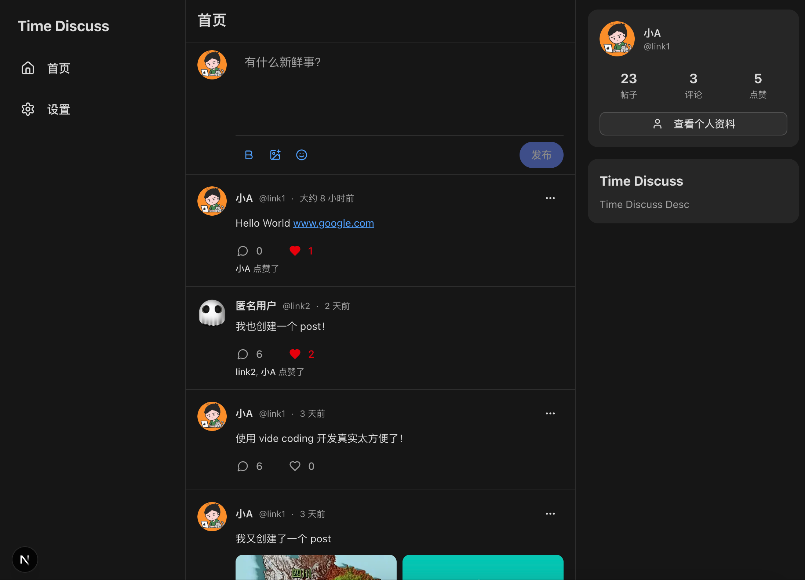

# Time Discuss

A social platform built with Next.js, supporting PWA (Progressive Web App) functionality.



## ✨ Key Features

- 📱 **PWA Support** - Installable as mobile/desktop app
- 💬 **Social Sharing** - Post publishing, comment interactions
- 🎨 **Modern UI** - Beautiful interface based on Tailwind CSS
- 🔐 **User Authentication** - Secure login and registration system
- 📝 **Rich Text Editor** - Support for Markdown and rich text content

## 🚀 Quick Deployment

1. **Install Dependencies**
   ```bash
   npm install
   ```
2. **Build Project**
   ```bash
   npm run build
   ```
3. **Configure Environment Variables**
   ```bash
   # Modify .env as prompted
   cp .env.example .env
   ```
4. **Initialize Database**
     ```bash
     npx prisma migrate deploy
     ```
5. **Start Service**
   ```bash
   npm run start
   ```

## 🚀 Quick Development

### Install Dependencies

```bash
npm install
```

### Start Development Server

```bash
npm run dev
```

Open [http://localhost:3000](http://localhost:3000) to view the application.


## 🚀 Development Setup

1. **Install Dependencies**
   ```bash
   npm install
   ```
2. **Configure Environment Variables**
     ```bash
     # Modify .env as prompted
     cp .env.example .env
     ```
3. **Update Database Schema**
     ```bash
     npx prisma db push
     ```
6. **Start Service**
   ```bash
   npm run dev
   ```

## 🔧 Tech Stack

- **Framework**: Next.js 15
- **Styling**: Tailwind CSS
- **Database**: Prisma + SQLite
- **Authentication**: NextAuth.js
- **PWA**: Web App Manifest + Service Worker
- **Types**: TypeScript
